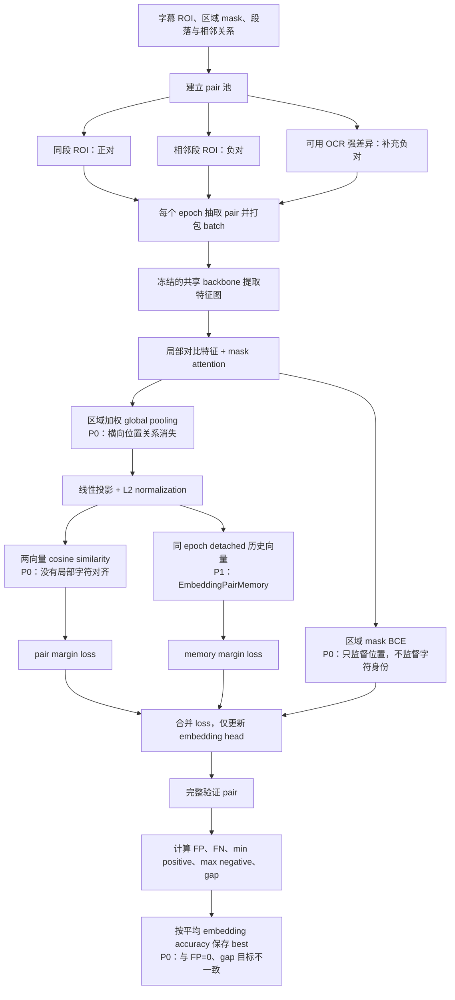

# ROI Embedding 优化约束

## 当前基线与目标

- 基线：`outputs/roi_embedding_full_batch128_mask_loss` epoch 150，`fp=12`、`fn=2`、`embedding_gap=-0.491`。
- 当前 width-token 候选：`outputs/roi_embedding_width_tokens_trial` 从零训练 epoch 6，`fp=6`、`fn=0`、`embedding_gap=-0.237`。
- 目标：`fp=0`、`fn` 可控、`embedding_gap >= -0.191`（至少提升 `0.3`）。

## 从零训练结果

width-token 候选使用 32 个宽度 token、256 维 embedding、batch size 128，
不加载旧 checkpoint，从 epoch 0 开始训练。

| checkpoint | FP | FN | embedding gap | max negative | min positive | pair accuracy |
|---|---:|---:|---:|---:|---:|---:|
| masked-global 基线 epoch 150 | 12 | 2 | -0.491 | 0.818 | 0.327 | 0.9949 |
| width-token epoch 5 | 15 | 0 | -0.253 | 0.788 | 0.535 | 0.9945 |
| width-token epoch 6 | 6 | 0 | -0.237 | 0.800 | 0.563 | 0.9978 |

epoch 6 相比旧基线将 FP 从 12 降至 6、FN 从 2 降至 0，
`embedding_gap` 提升 `0.254`，并在仅 6 个 epoch 时超过训练 150 个 epoch 的旧基线。
截至 epoch 13，checkpoint 排序仍选择 epoch 6 为 best，说明该收益已被保存规则正确捕获。
该结果确认 width-token 整体方案能更快得到更好的 embedding，但仍未达到
`fp=0` 和 `embedding_gap >= -0.191`，因此属于有效改进而非最终验收成功。

## 原 masked-global 基线训练流程

读图要点：空 ROI 不参加 embedding pair；memory 只保存本 epoch 先前 batch 的 detached 向量，并在下个 epoch 重建；验证中的 FP/FN 是 pair 数，不是 ROI 样本数。

## 已确认无效的方向

后续不要重复以下实验：

- 单纯增加 epoch、batch size 或继续原参数训练。
- 调整 hard-negative 采样比例、loss 权重、positive consistency 或 memory tail 权重。
- 解冻 backbone：更新 BN 会塌缩；冻结 BN 也没有足够收益。
- 在现有 global embedding 上叠加 spatial adapter、attention 指数或确定性空间轮廓。
- 只调整相似度阈值：不能改善 `embedding_gap`，只会转移 FP/FN。

这些方案都只在同一条权衡曲线上移动：降低 FP 时会压低正对下界并增加 FN。

## 原基线阻塞点与当前状态

分级含义：`P0` 为已确认且直接限制当前表示/训练目标的问题；`P1` 为已确认的实现事实，但尚未证明是主因；`P2` 为待单变量验证的推测。

| 级别 | 问题 | 性质 | 当前结论 |
|---|---|---|---|
| P0 | global pooling 消除横向位置关系 | 事实 | width-token 已替换该路径，并在 epoch 6 超过旧基线。 |
| P0 | attention 只用区域 mask 监督，不监督字符身份 | 事实 | 模型得到位置监督，但没有字符内容监督。 |
| P0 | 最终只对单向量 cosine similarity 施加 margin | 事实 | 训练目标没有局部字符对齐或差异定位。 |
| P0 | best checkpoint 按平均 embedding accuracy 选择 | 事实 | 当前已改为依次按 FP、FN、`embedding_gap` 排序。 |
| P1 | embedding 阶段冻结 backbone | 事实 | 已确认；其对字形区分能力的具体影响尚未隔离。 |
| P1 | 正对优先覆盖样本，而非最大视觉变化 | 事实 | 当前已优先选择同段最大时间跨度正对。 |
| P1 | EmbeddingPairMemory 使用 detached 历史 embedding | 事实 | 已确认；是否导致极值波动尚未证实。 |
| P2 | backbone 下采样是细小字形差异丢失的主因 | 推测 | 未做保持其他变量不变的分辨率实验。 |
| P2 | 冻结 backbone 使特征偏向 presence | 推测 | 解冻实验受 BN/训练分布影响，不能证明该因果。 |
| P2 | L2 normalization/cosine 是前缀字幕 FP 的主因 | 推测 | 只确认了算子存在，未隔离验证其因果。 |
| P2 | detached memory 导致训练指标反复波动 | 推测 | 调整 memory 权重没有形成充分的因果证据。 |

目前只确认多种参数和 residual adapter 方案无效，尚未严格确认某一个底层因素是唯一主因。

## 后续方向

1. 继续验证 width-token 从零训练路径；epoch 6 已确认能以较少轮数超过旧基线，
   当前重点是将 `fp=6` 降至 0，并把 `embedding_gap=-0.237` 提升至至少 `-0.191`。
2. 优先采用多 token 局部对齐相似度；若接口必须保持单向量，再将完整宽度序列编码到更高维 embedding。
3. 训练对重点覆盖：同段最大时间跨度正对，以及 OCR 高重叠的相邻段负对；不增加每轮 pair 总数。
4. 不加入 OCR 解码或文本输出，OCR 仅用于已有训练 pair 的筛选。

## 验收与停止规则

- checkpoint 排序：`fp == 0` 优先，其次 `fn`，最后 `embedding_gap`。
- 先跑 2～3 个 full-data epoch；若 `max_negative_similarity` 未下降且 `min_positive_similarity` 未保持，立即停止该方向。
- 未同时达到三个目标时，不得宣称优化成功。
