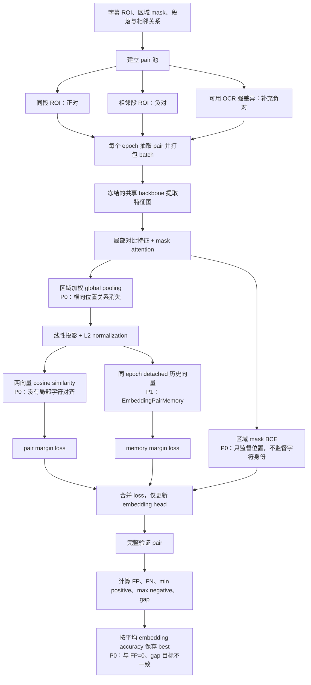
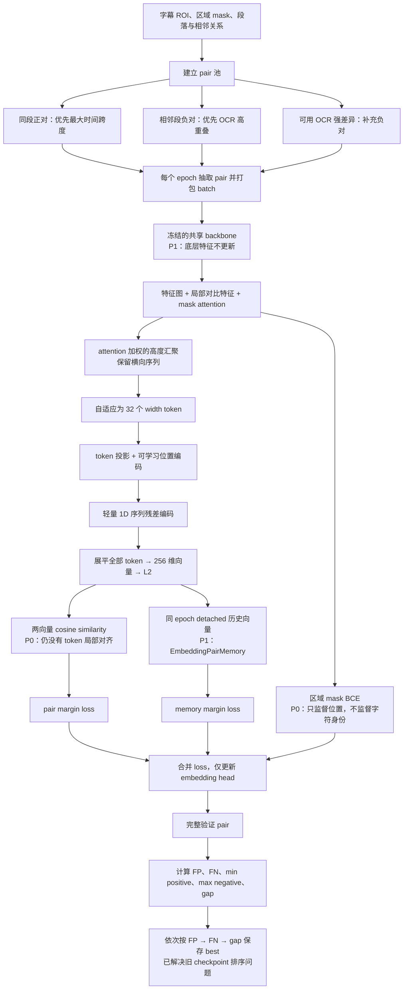

# ROI Embedding 优化约束

## 当前基线与目标

- 基线：`outputs/roi_embedding_full_batch128_mask_loss` epoch 150，`fp=12`、`fn=2`、`embedding_gap=-0.491`。
- 当前 width-token 候选：`outputs/roi_embedding_width_tokens_trial_dim256_run2` 从零训练，最佳 checkpoint 为 epoch 34，`fp=4`、`fn=0`、`embedding_gap=-0.128940`。
- 目标：`fp=0`、`fn` 可控、`embedding_gap >= 0`（相对基线至少提升 `0.491`）。

## 实验结果

### Width-token 主线：从零训练结果

width-token 候选使用 32 个宽度 token、256 维 embedding、batch size 128，
不加载旧 checkpoint，从 epoch 0 开始训练。

| checkpoint | FP | FN | embedding gap | max negative | min positive | pair accuracy |
|---|---:|---:|---:|---:|---:|---:|
| masked-global 基线 epoch 150 | 12 | 2 | -0.491 | 0.818 | 0.327 | 0.9949 |
| `roi_embedding_width_tokens_trial_dim256_run2` epoch 34 | 4 | 0 | -0.128940 | 0.764591 | 0.635651 | 0.9985 |

`outputs/roi_embedding_width_tokens_trial_dim256_run2` epoch 34 相比旧基线将 FP 从 12 降至 4、FN 从 2 降至 0，
`embedding_gap` 提升约 `0.362`，并超过训练 150 个 epoch 的旧基线。
checkpoint 排序选择 epoch 34 为 best，说明该收益已被保存规则正确捕获。
该结果仍未达到 `embedding_gap >= 0` 和 `fp=0`，因此属于当前最佳有效改进，尚未最终验收成功。
剩余 4 个 FP 均来自“不要”与“不是”两个字幕段的帧组合。

### Local Alignment A3 备选结果

`outputs/roi_embedding_width_local_alignment_a3_dim256` 使用
`32 width tokens + ±3 banded MaxSim + bottom-20% 聚合 + Extreme Gap Loss`。
继续训练后，最佳 checkpoint 为 epoch 11：

| checkpoint | FP | FN | embedding gap | max negative | min positive | pair accuracy |
|---|---:|---:|---:|---:|---:|---:|
| `roi_embedding_width_local_alignment_a3_dim256` epoch 11 | 0 | 4 | -0.061404 | 0.390017 | 0.328613 | 0.9985 |

该结果首次将 `FP` 降至 0，且 `embedding_gap` 已接近但尚未达到 `0`，说明局部对齐方向能够改善最危险负对；
但 `FN=4`，并且 multi-token 局部匹配的运行性能明显差于当前单向量 cosine 路径。
因此该 checkpoint 仅作为备选方案保留，暂时不作为主线继续开发或叠加更多模块。
当前主线仍为 `outputs/roi_embedding_width_tokens_trial_dim256_run2` 的 width-token 单向量方案。

### Width-token 的难样本：“不要”与“不是”

width-token 当前最佳 checkpoint 的全部 4 个 FP，实际来自同一对相邻字幕段的 `2 × 2` 帧组合。
使用相同 ROI 分别通过三个模式的最佳 checkpoint 重新推理，结果如下：

| 字幕 A | frame A | 字幕 B | frame B | masked-global epoch 150 | width-token epoch 34 | local-alignment epoch 11 |
|---|---:|---|---:|---:|---:|---:|
| 不要 | 30660 | 不是 | 30900 | 0.381784（TN） | 0.764591（FP） | 0.390017（TN） |
| 不要 | 30630 | 不是 | 30900 | 0.433533（TN） | 0.756131（FP） | 0.375963（TN） |
| 不要 | 30660 | 不是 | 30930 | 0.270738（TN） | 0.754177（FP） | 0.369344（TN） |
| 不要 | 30630 | 不是 | 30930 | 0.338966（TN） | 0.745801（FP） | 0.356226（TN） |

masked-global 和 width-token 列为单向量 cosine similarity；local-alignment 列为基于 token cosine
的带宽约束双向局部对齐最终分数。三种模式统一使用 `0.5` 判定阈值，括号中标记该负对最终为
真负样本（TN）或假正样本（FP）。

两个字幕段分别为 `video0001_f00030630`（“不要”）和 `video0001_f00030900`（“不是”）。
后续 width-token 调优将这组只有单字差异、视觉结构高度相似的难负样本作为重点：目标是在保持当前
正对下界和 `embedding_gap` 的同时，将上述 4 个相似度全部压到 `0.5` 以下，而不是仅通过调整推理
阈值转移 FP/FN。

### Local-alignment 的难样本

local-alignment epoch 11 已将验证集 FP 降至 0，但仍有 4 个同段正对低于 `0.5`，全部表现为 FN：

| 字幕 | frame A | frame B | local-alignment similarity | 距离 0.5 阈值 |
|---|---:|---:|---:|---:|
| 西装 | 23280 | 23310 | 0.328613 | -0.171387 |
| 谢谢 | 23520 | 23580 | 0.402870 | -0.097130 |
| 等等 | 17160 | 17190 | 0.465760 | -0.034240 |
| 谢谢 | 23550 | 23610 | 0.467886 | -0.032114 |

这 4 个 pair 都来自同一字幕段的不同帧，说明当前 local-alignment 对局部 token 的跨帧变化仍然过于
敏感。后续若继续该方向，重点应是在不重新引入 FP、不抬高最高负对的前提下，将上述正对全部提升到
`0.5` 以上，并使 `min_positive_similarity` 高于 `max_negative_similarity`，即 `embedding_gap >= 0`。

### Masked-global 的难样本

masked-global 能够区分“不要”与“不是”：上述 4 个负对的 cosine similarity 为
`0.270738～0.433533`，全部低于 `0.5`，因此均为 TN。它在 epoch 150 的实际错误由 12 个 FP 和
2 个 FN 组成，主要集中在前缀包含型字幕，而不是“不要/不是”这种单字差异：

| 类型 | 字幕或关系 | pair 数 | similarity 范围 | 说明 |
|---|---|---:|---:|---|
| FP | “这个” / “这个放在这里” | 8 | 0.566839～0.817634 | 相同前缀被判为同一字幕，是 masked-global 最主要的难负样本 |
| FP | “真的吗” / “真的可以吗” | 2 | 0.659645～0.688095 | 同样属于高重叠、前缀相似字幕 |
| FP | “来吧” / “那个烤串好咸” | 1 | 0.518292 | 略高于判定阈值 |
| FP | “男人” / “这个和那个是两回事” | 1 | 0.514677 | 略高于判定阈值 |
| FN | 同段“好危险” | 1 | 0.326504 | 同一字幕的不同帧相似度过低 |
| FN | 同段“西装” | 1 | 0.417384 | 同一字幕的不同帧相似度过低 |

因此 masked-global 对“不要/不是”表现正常，但其全局池化表示容易把共享前缀当成整体相似，也会在
同一字幕跨帧视觉变化时把正对拉到阈值以下。调优不能只针对“不要/不是”，还需要同时覆盖前缀包含型
负对和跨帧变化较大的同段正对。

## 工程成本对比

### Width-token 与 Local-alignment 推理耗时

使用真实 checkpoint 和“不要”/“不是”两个 `256 × 64` ROI 测试。width-token 使用
`outputs/roi_embedding_width_tokens_trial_dim256_run2/best.pt` epoch 34，local-alignment 使用
`outputs/roi_embedding_width_local_alignment_a3_dim256/best.pt` epoch 11。测试环境为 Apple Silicon、
PyTorch 2.12.1；测试时暂停正在运行的训练进程，测试结束后恢复。结果不包含图片读取、缩放和归一化。

| 完整判断流程 | width-token | local-alignment | local/width 倍率 |
|---|---:|---:|---:|
| MPS，两个 ROI 合并为 batch | 1.983 ms | 3.179 ms | 1.60× |
| MPS，两个 ROI 分别推理 | 2.481 ms | 4.209 ms | 1.70× |
| CPU，两个 ROI 合并为 batch | 4.297 ms | 4.221 ms | 0.98× |
| CPU，两个 ROI 分别推理 | 4.445 ms | 4.472 ms | 1.01× |

local-alignment 分阶段耗时：

| 阶段 | MPS 中位数 | MPS P90 | CPU 中位数 |
|---|---:|---:|---:|
| 两个 ROI 提取 embedding | 1.387 ms | 1.889 ms | 4.240 ms |
| 已缓存 embedding 的比较判定 | 1.942 ms | 3.670 ms | 0.116 ms |
| batch 完整流程 | 3.179 ms | 4.581 ms | 4.221 ms |
| 分别推理完整流程 | 4.209 ms | 5.350 ms | 4.472 ms |

local-alignment 每个 ROI 输出 `[32, 64]`，FP32 占 8 KB；width-token 每个 ROI 输出 256 维，
FP32 占 1 KB。当前实现中，local-alignment 在 MPS 上判断一对 ROI 比 width-token 增加约
`1.2～1.7 ms`，CPU 完整耗时则基本相同。若 embedding 已缓存，local-alignment 的局部比较放在
CPU 上执行仅约 `0.116 ms`，明显低于当前 MPS 实现的 `1.942 ms`。

### 不同 Embedding 模式的模型产物大小

以下为当前实际训练 checkpoint 大小。MiB 按 `1024²` 字节计算；`best.pt` 和
`best_embedding.pt` 都包含模型权重、optimizer 状态、训练设置和指标，并不是只含推理权重的部署模型。

| 模式与 checkpoint | `best.pt` | `best_embedding.pt` | 模型 tensor | optimizer tensor | 模型 state 参数量 |
|---|---:|---:|---:|---:|---:|
| 原 masked-global：`roi_embedding_full_batch128_mask_loss` | 1.658 MiB | 1.663 MiB | 0.811 MiB | 0.816 MiB | 212,555 |
| width-token：`roi_embedding_width_tokens_trial_dim256_run2` | **8.214 MiB** | **8.217 MiB** | 2.993 MiB | 5.180 MiB | 784,523 |
| local-alignment：`roi_embedding_width_local_alignment_a3_dim256` | 1.453 MiB | 1.459 MiB | 0.741 MiB | 0.677 MiB | 194,315 |

width-token checkpoint 约为原 masked-global 的 5 倍。主要增量来自将 `32 × 64 = 2048`
个 token 特征压缩为 256 维单向量的 projection MLP：其中 `2048 → 256` 和 `256 → 256`
两层合计约 59 万个参数。checkpoint 还保存 Adam optimizer 的一阶、二阶状态，因此新增权重会进一步
放大训练产物；当前 width-token 的 optimizer tensor 单独占约 5.18 MiB。

local-alignment 不包含上述 projection MLP，所以训练 checkpoint 只有约 1.45 MiB。需要区分模型产物
大小和单个 ROI 的 embedding 输出大小：local-alignment 模型文件较小，但每个 ROI 输出 8 KB；
width-token 模型文件较大，但每个 ROI 只输出 1 KB。若只导出推理所需模型并移除 optimizer，预计大小
应更接近表中的“模型 tensor”，不能直接用当前 `best.pt` 大小作为最终部署模型大小。

## 训练流程

### 原 masked-global 基线训练流程（历史对照）

该图仅用于解释旧基线及其问题，当前默认训练不再使用 masked-global 路径。

### 当前 width-token Embedding 训练流程

读图要点：当前默认使用 32 个 width token 和 256 维单向量 embedding；空 ROI 不参加 embedding pair；memory 只保存本 epoch 先前 batch 的 detached 向量，并在下个 epoch 重建；验证中的 FP/FN 是 pair 数，不是 ROI 样本数。

## 已确认无效的方向

后续不要重复以下实验：

- 单纯增加 epoch、batch size 或继续原参数训练。
- 调整 hard-negative 采样比例、loss 权重、positive consistency 或 memory tail 权重。
- 解冻 backbone：更新 BN 会塌缩；冻结 BN 也没有足够收益。
- 在现有 global embedding 上叠加 spatial adapter、attention 指数或确定性空间轮廓。
- 只调整相似度阈值：不能改善 `embedding_gap`，只会转移 FP/FN。

这些方案都只在同一条权衡曲线上移动：降低 FP 时会压低正对下界并增加 FN。

## 原基线阻塞点与当前状态

分级含义：`P0` 为已确认且直接限制当前表示/训练目标的问题；`P1` 为已确认的实现事实，但尚未证明是主因；`P2` 为待单变量验证的推测。

| 级别 | 问题 | 性质 | 当前结论 |
|---|---|---|---|
| P0 | global pooling 消除横向位置关系 | 事实 | `roi_embedding_width_tokens_trial_dim256_run2` 的 width-token 路径已替换该路径，并在 epoch 34 超过旧基线。 |
| P0 | attention 只用区域 mask 监督，不监督字符身份 | 事实 | 模型得到位置监督，但没有字符内容监督。 |
| P0 | 最终只对单向量 cosine similarity 施加 margin | 事实 | 训练目标没有局部字符对齐或差异定位。 |
| P0 | best checkpoint 按平均 embedding accuracy 选择 | 事实 | 当前已改为依次按 FP、FN、`embedding_gap` 排序。 |
| P1 | embedding 阶段冻结 backbone | 事实 | 已确认；其对字形区分能力的具体影响尚未隔离。 |
| P1 | 正对优先覆盖样本，而非最大视觉变化 | 事实 | 当前已优先选择同段最大时间跨度正对。 |
| P1 | EmbeddingPairMemory 使用 detached 历史 embedding | 事实 | 已确认；是否导致极值波动尚未证实。 |
| P2 | backbone 下采样是细小字形差异丢失的主因 | 推测 | 未做保持其他变量不变的分辨率实验。 |
| P2 | 冻结 backbone 使特征偏向 presence | 推测 | 解冻实验受 BN/训练分布影响，不能证明该因果。 |
| P2 | L2 normalization/cosine 是前缀字幕 FP 的主因 | 推测 | 只确认了算子存在，未隔离验证其因果。 |
| P2 | detached memory 导致训练指标反复波动 | 推测 | 调整 memory 权重没有形成充分的因果证据。 |

目前只确认多种参数和 residual adapter 方案无效，尚未严格确认某一个底层因素是唯一主因。

## 后续方向

1. 当前 width-token 最佳结果为 `outputs/roi_embedding_width_tokens_trial_dim256_run2` epoch 34；`embedding_gap=-0.128940` 尚未达到目标，
   当前重点是将 `embedding_gap` 提升到 0，同时将 `fp=4` 降至 0。
2. Local Alignment A3 保留为备选，不作为当前主线继续开发；主线继续保持单向量 cosine 接口和推理性能。
3. 训练对重点覆盖：同段最大时间跨度正对，以及 OCR 高重叠的相邻段负对；不增加每轮 pair 总数。
4. 不加入 OCR 解码或文本输出，OCR 仅用于已有训练 pair 的筛选。

## 验收与停止规则

- checkpoint 排序：`fp == 0` 优先，其次 `fn`，最后 `embedding_gap`。
- 先跑 2～3 个 full-data epoch；若 `max_negative_similarity` 未下降且 `min_positive_similarity` 未保持，立即停止该方向。
- 未同时达到三个目标时，不得宣称优化成功。
