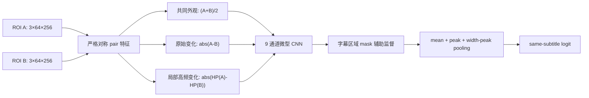
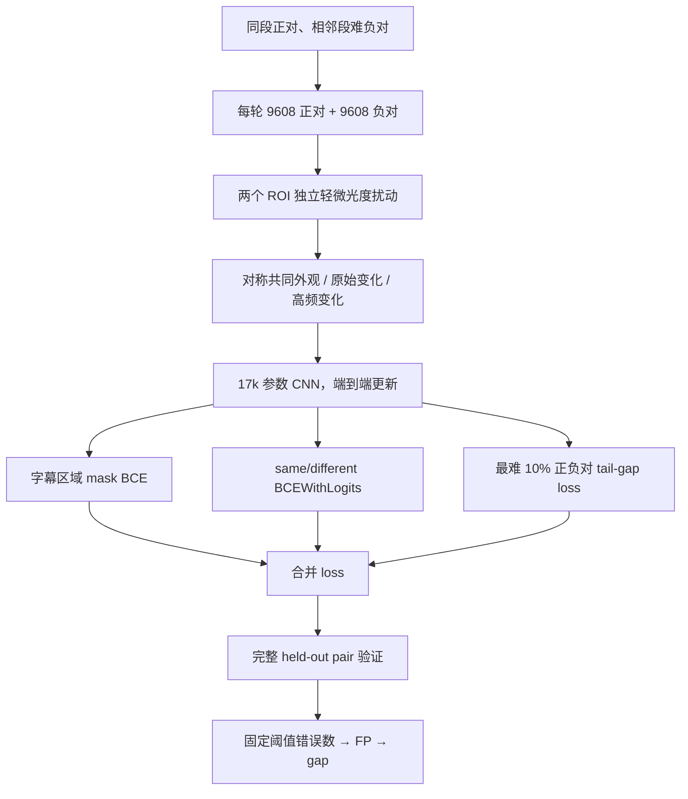
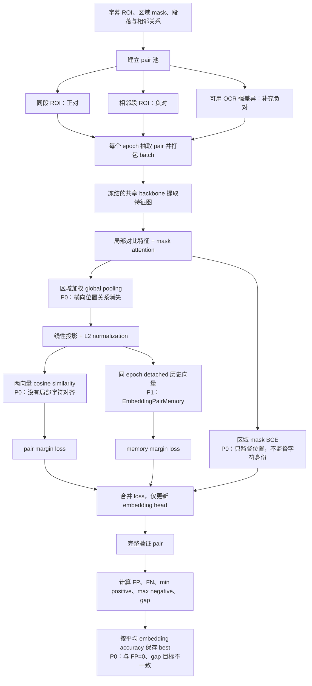
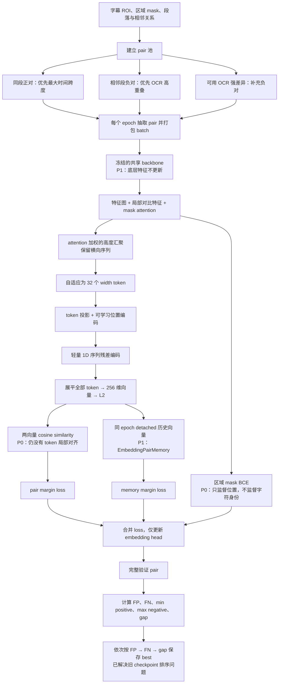

# ROI Pair Matcher 优化记录

## 当前基线与目标

- 历史基线：`outputs/roi_embedding_full_batch128_mask_loss` epoch 150，`fp=12`、`fn=2`、`embedding_gap=-0.491129`。
- 历史 width-token：`outputs/roi_embedding_width_tokens_trial_dim256_run2` epoch 34，`fp=4`、`fn=0`、`embedding_gap=-0.128940`。
- 新主线：独立 `RoiPairMatcher`，直接输入两个 ROI 并输出同字幕概率，不再生成全局 embedding。
- 当前仓库 checkpoint：`outputs/roi_pair_matcher` epoch 3，固定阈值 `0.5` 下 `fp=0`、`fn=0`、`pair_gap=+0.956748`。
- 目标已经在当前 `roi_validation_samples` 上达到；额外 leave-one-video-out 检查仍有 9 个 FN，因此跨视频零错误门槛尚未达到。

## 当前推荐方案：Direct Pair Matcher

当前问题本质上是一个二元关系判断，不是检索任务。旧方案先把每个 ROI 压成独立 descriptor，再用固定 cosine/MaxSim
比较；新方案改为直接学习严格对称的 `same / different` 关系：

设计要点：

- `score(A, B) == score(B, A)` 由输入算子保证，不依赖交换增强近似实现。
- 原始差异保留单字变化；局部高频差异抑制平滑背景变化；共同外观让网络定位字幕而不是只看变化强度。
- 宽度方向只下采样到 64，使用 width-peak pooling 保留单个字符的局部最坏证据。
- 全模型端到端训练，不再冻结随机初始化 backbone。
- 主损失为 balanced `BCEWithLogits`，加 batch 内最难 10% 正负对的 tail-gap loss，以及字幕区域 mask 辅助损失。
- 优化后的部署 runtime 只输出一个 same-subtitle logit，不输出辅助 mask、128/256 维向量或 `[32,64]` token，因此没有 descriptor 存储和二次 MaxSim 成本。

### MPS 推理优化

部署路径不修改训练 checkpoint：先把 8 组 Conv-BatchNorm 数学等价地融合到卷积权重，再用实际 batch-1 输入建立 TorchScript trace。width 证据从 Top-K 均值改为最大响应，移除了 MPS 上最慢的排序算子。

固定口径为 Apple M4、PyTorch 2.12.1、FP32、batch 1、两个 `256×64` tensor 已在 MPS、40 次 warmup、每次 forward 后同步。5 轮各 500 次结果为：

| 指标 | 优化前 | 优化后 |
|---|---:|---:|
| MPS median | `1.16 ms` | `0.561–0.572 ms` |
| MPS P90 | `1.79 ms` | `0.669–0.701 ms` |

当前产物刷新时的独立复测为 median `0.560 ms`、P90 `0.661 ms`。计时仅包含 forward，输入和输出均留在 MPS；不包含 I/O、resize、设备传输、sigmoid、阈值或 CPU 读取。现有 checkpoint 在改用 width-peak 后完整验证仍为 `2,724/2,724` 正确，`min positive=0.986498`、`max negative=0.029750`。

设计依据来自直接 patch comparison、轻量变化检测和真实设备延迟原则：

- [DeepCompare](https://www.cv-foundation.org/openaccess/content_cvpr_2015/papers/Zagoruyko_Learning_to_Compare_2015_CVPR_paper.pdf)：直接联合比较 patch 可以优于固定 Siamese 距离。
- [TinyCD](https://arxiv.org/abs/2207.13159)：轻量双输入模型应在空间位置上显式混合两侧特征。
- [ShuffleNetV2](https://openaccess.thecvf.com/content_ECCV_2018/html/Ningning_Light-weight_CNN_Architecture_ECCV_2018_paper.html)：不能只看 FLOPs，必须在目标硬件测真实延迟。
- [MobileOne](https://machinelearning.apple.com/research/mobileone)：移动端速度优先使用简单、可部署的卷积算子，并以真实设备结果为准。

### 三个随机种子的真实结果

训练集为 `roi_samples1..6`，每轮 `9,608` 正对和 `9,608` 负对；验证集为独立的
`roi_validation_samples`，共 `627` 正对、`1,468` local 负对、`629` OCR 负对。三次均训练 3 epoch，
表中记录各自按“固定 `0.5` 错误总数 → FP → gap”选出的最佳 checkpoint：

当前 scheduler 先使用更难的相邻段 local negatives；它们已经填满每轮 9,608 个负对预算，所以训练实际
没有抽到 OCR negative。验证仍按完整规则补入 629 个 OCR negative，并且三个最佳 checkpoint 对这部分均为 100% 正确。

| seed / checkpoint | best epoch | FP | FN | min positive | max negative | pair gap | MPS median / P90 | epoch time |
|---|---:|---:|---:|---:|---:|---:|---:|---:|
| `roi_pair_matcher_trial` / 2026 | 1 | 0 | 0 | 0.854419 | 0.168075 | +0.686344 | 1.148 / 1.548 ms | 58.97 s |
| `roi_pair_matcher_seed2027` | 2 | 0 | 0 | 0.898092 | 0.222136 | +0.675956 | 1.147 / 1.235 ms | 46.29 s |
| `roi_pair_matcher_seed2028` | **3** | **0** | **0** | **0.977785** | **0.025238** | **+0.952548** | **1.209 / 1.332 ms** | **49.52 s** |

三个 seed 的最佳 checkpoint 均在固定 `0.5` 阈值达到 `FP=0、FN=0`，不是通过移动阈值得到。
seed 2028 的最危险负对仍是“不要 / 不是”，但分数已降到 `0.025238`；最低正对“谢谢 / 谢谢”为
`0.977785`。最佳推理 checkpoint 为 90,533 bytes，模型 tensor 为 70,664 bytes，只有 17,074 个可训练参数。
`pair_gap` 基于 sigmoid 概率，旧 `embedding_gap` 基于 cosine；两者可以比较是否完全分离和错误数，
但不能把 gap 的绝对数值当作同一量纲直接相除。

### 额外 leave-one-video-out 检查

为了避免只在原验证视频上得出结论，另做了一次更严格检查：将 `roi_samples2` 完全移出训练，使用
`roi_samples1,3,4,5,6` 训练，再在 samples2 的 `768` 正对和 `3,453` 负对上验证。seed 2028 epoch 3 为：

| holdout | pair accuracy | FP | FN | ROC-AUC | min positive | max negative | pair gap |
|---|---:|---:|---:|---:|---:|---:|---:|
| `roi_samples2` | 0.997868 | 0 | 9 | 0.999990 | 0.004562 | 0.177118 | -0.172556 |

这证明原验证集的 `0/0` 不是 pair 索引或数据重叠造成，但也证明当前模型尚不能宣称对所有未见视频零错误。
9 个错误全部是 FN；主要来自大幅背景变化、超长双行字幕等同段正对。当前 `roi_samples1..6` 全量训练的
最终模型已经见过 samples2，这个实验用于衡量架构泛化，不替代正式 held-out checkpoint。

## 实验结果

### Width-token 主线：从零训练结果

width-token 候选使用 32 个宽度 token、256 维 embedding、batch size 128，
不加载旧 checkpoint，从 epoch 0 开始训练。

| checkpoint | FP | FN | embedding gap | max negative | min positive | pair accuracy |
|---|---:|---:|---:|---:|---:|---:|
| masked-global 基线 epoch 150 | 12 | 2 | -0.491 | 0.818 | 0.327 | 0.9949 |
| `roi_embedding_width_tokens_trial_dim256_run2` epoch 34 | 4 | 0 | -0.128940 | 0.764591 | 0.635651 | 0.9985 |

`outputs/roi_embedding_width_tokens_trial_dim256_run2` epoch 34 相比旧基线将 FP 从 12 降至 4、FN 从 2 降至 0，
`embedding_gap` 提升约 `0.362`，并超过训练 150 个 epoch 的旧基线。
checkpoint 排序选择 epoch 34 为 best，说明该收益已被保存规则正确捕获。
该结果仍未达到 `embedding_gap >= 0` 和 `fp=0`，现在仅保留为历史单向量对照。
剩余 4 个 FP 均来自“不要”与“不是”两个字幕段的帧组合。

### Local Alignment A3 备选结果

`outputs/roi_embedding_width_local_alignment_a3_dim256` 使用
`32 width tokens + ±3 banded MaxSim + bottom-20% 聚合`。实际 checkpoint 中
`embedding_extreme_gap_weight=0.0`，因此这次结果不能归因于 Extreme Gap Loss。
继续训练后，最佳 checkpoint 为 epoch 11：

| checkpoint | FP | FN | embedding gap | max negative | min positive | pair accuracy |
|---|---:|---:|---:|---:|---:|---:|
| `roi_embedding_width_local_alignment_a3_dim256` epoch 11 | 0 | 4 | -0.061404 | 0.390017 | 0.328613 | 0.9985 |

epoch 11 是旧排序规则保存的 `best.pt`，但完整日志中 epoch 15 实际达到
`min positive=0.473848`、`max negative=0.411927`、`gap=+0.061921`、ROC-AUC=1.0；在阈值
`0.473848` 可实现 `FP=0、FN=0`，固定 `0.5` 时为 `FP=0、FN=5`。旧排序先比较固定阈值 FN，
因此错误地让 epoch 11 覆盖了已经完全可分的 epoch 15。该事实证明“保留局部差异”方向正确，
但其运行时 MaxSim 和 8 KiB descriptor 已被 Direct Pair Matcher 以更小、更快的方式替代。

### Width-token 的难样本：“不要”与“不是”

width-token 当前最佳 checkpoint 的全部 4 个 FP，实际来自同一对相邻字幕段的 `2 × 2` 帧组合。
使用相同 ROI 分别通过三个模式的最佳 checkpoint 重新推理，结果如下：

| 字幕 A | frame A | 字幕 B | frame B | masked-global epoch 150 | width-token epoch 34 | local-alignment epoch 11 |
|---|---:|---|---:|---:|---:|---:|
| 不要 | 30660 | 不是 | 30900 | 0.381784（TN） | 0.764591（FP） | 0.390017（TN） |
| 不要 | 30630 | 不是 | 30900 | 0.433533（TN） | 0.756131（FP） | 0.375963（TN） |
| 不要 | 30660 | 不是 | 30930 | 0.270738（TN） | 0.754177（FP） | 0.369344（TN） |
| 不要 | 30630 | 不是 | 30930 | 0.338966（TN） | 0.745801（FP） | 0.356226（TN） |

masked-global 和 width-token 列为单向量 cosine similarity；local-alignment 列为基于 token cosine
的带宽约束双向局部对齐最终分数。三种模式统一使用 `0.5` 判定阈值，括号中标记该负对最终为
真负样本（TN）或假正样本（FP）。

两个字幕段分别为 `video0001_f00030630`（“不要”）和 `video0001_f00030900`（“不是”）。
这组只有单字差异、视觉结构高度相似的负对曾是 width-token 的主要阻塞点。Direct Pair seed 2028
已在固定 `0.5` 阈值将其中最高分压到 `0.025238`，因此不再继续调 width-token。

### Local-alignment 的难样本

local-alignment epoch 11 已将验证集 FP 降至 0，但仍有 4 个同段正对低于 `0.5`，全部表现为 FN：

| 字幕 | frame A | frame B | local-alignment similarity | 距离 0.5 阈值 |
|---|---:|---:|---:|---:|
| 西装 | 23280 | 23310 | 0.328613 | -0.171387 |
| 谢谢 | 23520 | 23580 | 0.402870 | -0.097130 |
| 等等 | 17160 | 17190 | 0.465760 | -0.034240 |
| 谢谢 | 23550 | 23610 | 0.467886 | -0.032114 |

这 4 个 pair 都来自同一字幕段的不同帧，说明 local-alignment epoch 11 对局部 token 的跨帧变化过于
敏感。Direct Pair 当前最低正对为 `0.977785`，该历史问题已由新路径解决。

### Masked-global 的难样本

masked-global 能够区分“不要”与“不是”：上述 4 个负对的 cosine similarity 为
`0.270738～0.433533`，全部低于 `0.5`，因此均为 TN。它在 epoch 150 的实际错误由 12 个 FP 和
2 个 FN 组成，主要集中在前缀包含型字幕，而不是“不要/不是”这种单字差异：

| 类型 | 字幕或关系 | pair 数 | similarity 范围 | 说明 |
|---|---|---:|---:|---|
| FP | “这个” / “这个放在这里” | 8 | 0.566839～0.817634 | 相同前缀被判为同一字幕，是 masked-global 最主要的难负样本 |
| FP | “真的吗” / “真的可以吗” | 2 | 0.659645～0.688095 | 同样属于高重叠、前缀相似字幕 |
| FP | “来吧” / “那个烤串好咸” | 1 | 0.518292 | 略高于判定阈值 |
| FP | “男人” / “这个和那个是两回事” | 1 | 0.514677 | 略高于判定阈值 |
| FN | 同段“好危险” | 1 | 0.326504 | 同一字幕的不同帧相似度过低 |
| FN | 同段“西装” | 1 | 0.417384 | 同一字幕的不同帧相似度过低 |

因此 masked-global 对“不要/不是”表现正常，但其全局池化表示容易把共享前缀当成整体相似，也会在
同一字幕跨帧视觉变化时把正对拉到阈值以下。调优不能只针对“不要/不是”，还需要同时覆盖前缀包含型
负对和跨帧变化较大的同段正对。

## 工程成本对比

### 历史运行时参考（条件不完全相同）

真实 checkpoint、预加载并归一化的两个 `256×64` ROI、Apple Silicon、PyTorch 2.12.1。Direct Pair
表中的 Direct Pair MPS 数字使用 width-peak、Conv-BN 融合和 traced 部署图；其他列及 CPU 数字保留历史普通 eval 路径，因此只作量级参考，不用于纯架构同比：

| forward-only | width-token epoch 34 | local-alignment epoch 11 | Direct Pair seed 2028 |
|---|---:|---:|---:|
| MPS median | 1.609 ms | 3.390 ms | **0.560 ms** |
| MPS P90 | 2.877 ms | 5.129 ms | **0.661 ms** |
| CPU median | 5.756 ms | 5.804 ms | **1.132 ms** |
| full-data epoch median / best epoch | 81.75 s | 97.43 s | **49.52 s** |

Direct Pair 的部署路径直接完成一对 ROI 的 forward，因此没有“先保存 descriptor、再运行比较器”的额外阶段。

### 历史 Width-token 与 Local-alignment 推理耗时

使用真实 checkpoint 和“不要”/“不是”两个 `256 × 64` ROI 测试。width-token 使用
`outputs/roi_embedding_width_tokens_trial_dim256_run2/best.pt` epoch 34，local-alignment 使用
`outputs/roi_embedding_width_local_alignment_a3_dim256/best.pt` epoch 11。测试环境为 Apple Silicon、
PyTorch 2.12.1；测试时暂停正在运行的训练进程，测试结束后恢复。结果不包含图片读取、缩放和归一化。

| 完整判断流程 | width-token | local-alignment | local/width 倍率 |
|---|---:|---:|---:|
| MPS，两个 ROI 合并为 batch | 1.983 ms | 3.179 ms | 1.60× |
| MPS，两个 ROI 分别推理 | 2.481 ms | 4.209 ms | 1.70× |
| CPU，两个 ROI 合并为 batch | 4.297 ms | 4.221 ms | 0.98× |
| CPU，两个 ROI 分别推理 | 4.445 ms | 4.472 ms | 1.01× |

local-alignment 分阶段耗时：

| 阶段 | MPS 中位数 | MPS P90 | CPU 中位数 |
|---|---:|---:|---:|
| 两个 ROI 提取 embedding | 1.387 ms | 1.889 ms | 4.240 ms |
| 已缓存 embedding 的比较判定 | 1.942 ms | 3.670 ms | 0.116 ms |
| batch 完整流程 | 3.179 ms | 4.581 ms | 4.221 ms |
| 分别推理完整流程 | 4.209 ms | 5.350 ms | 4.472 ms |

local-alignment 每个 ROI 输出 `[32, 64]`，FP32 占 8 KB；width-token 每个 ROI 输出 256 维，
FP32 占 1 KB。当前实现中，local-alignment 在 MPS 上判断一对 ROI 比 width-token 增加约
`1.2～1.7 ms`，CPU 完整耗时则基本相同。若 embedding 已缓存，local-alignment 的局部比较放在
CPU 上执行仅约 `0.116 ms`，明显低于当前 MPS 实现的 `1.942 ms`。

### 不同 Embedding 模式的模型产物大小

Direct Pair 与旧模式的纯模型大小对比：

| 模式 | 可训练参数 | 模型 tensor | 最小推理 checkpoint | 每个 ROI descriptor |
|---|---:|---:|---:|---:|
| masked-global | 211,586 | 850,256 B | 未单独导出 | 512 B |
| width-token | 783,554 | 3,138,128 B | 未单独导出 | 1 KiB |
| local-alignment | 193,346 | 777,296 B | 未单独导出 | 8 KiB |
| **Direct Pair** | **17,074** | **70,664 B** | **90,533 B** | **0 B** |

Direct Pair 的纯模型 tensor 是 width-token 的约 `1/44`、local-alignment 的约 `1/11`；推理时只返回
一个 same-subtitle score，不产生需要缓存的 descriptor。

以下为当前实际训练 checkpoint 大小。MiB 按 `1024²` 字节计算；`best.pt` 和
`best_embedding.pt` 都包含模型权重、optimizer 状态、训练设置和指标，并不是只含推理权重的部署模型。

| 模式与 checkpoint | `best.pt` | `best_embedding.pt` | 模型 tensor | optimizer tensor | 模型 state 参数量 |
|---|---:|---:|---:|---:|---:|
| 原 masked-global：`roi_embedding_full_batch128_mask_loss` | 1.658 MiB | 1.663 MiB | 0.811 MiB | 0.816 MiB | 212,555 |
| width-token：`roi_embedding_width_tokens_trial_dim256_run2` | **8.214 MiB** | **8.217 MiB** | 2.993 MiB | 5.180 MiB | 784,523 |
| local-alignment：`roi_embedding_width_local_alignment_a3_dim256` | 1.453 MiB | 1.459 MiB | 0.741 MiB | 0.677 MiB | 194,315 |

width-token checkpoint 约为原 masked-global 的 5 倍。主要增量来自将 `32 × 64 = 2048`
个 token 特征压缩为 256 维单向量的 projection MLP：其中 `2048 → 256` 和 `256 → 256`
两层合计约 59 万个参数。checkpoint 还保存 Adam optimizer 的一阶、二阶状态，因此新增权重会进一步
放大训练产物；当前 width-token 的 optimizer tensor 单独占约 5.18 MiB。

local-alignment 不包含上述 projection MLP，所以训练 checkpoint 只有约 1.45 MiB。需要区分模型产物
大小和单个 ROI 的 embedding 输出大小：local-alignment 模型文件较小，但每个 ROI 输出 8 KB；
width-token 模型文件较大，但每个 ROI 只输出 1 KB。若只导出推理所需模型并移除 optimizer，预计大小
应更接近表中的“模型 tensor”，不能直接用当前 `best.pt` 大小作为最终部署模型大小。

## 训练流程

### 当前 Direct Pair Matcher 训练流程

这条路径由独立 CLI `train-roi-pair` 运行，不包含 presence head，不冻结任何随机特征层，也不使用 OCR
作为模型输入。OCR 只沿用可信 pair 池的筛选语义。

### 原 masked-global 基线训练流程（历史对照）

该图仅用于解释旧基线及其问题，当前默认训练不再使用 masked-global 路径。

### 历史 width-token Embedding 训练流程

读图要点：旧 `train-roi` 默认使用 32 个 width token 和 256 维单向量 embedding；空 ROI 不参加 embedding pair；memory 只保存本 epoch 先前 batch 的 detached 向量，并在下个 epoch 重建；验证中的 FP/FN 是 pair 数，不是 ROI 样本数。

## 已确认无效的方向

后续不要重复以下实验：

- 单纯增加 epoch、batch size 或继续原参数训练。
- 调整 hard-negative 采样比例、loss 权重、positive consistency 或 memory tail 权重。
- 在旧双头/旧 embedding 路径中直接解冻既有 backbone：更新 BN 会塌缩，冻结 BN 也没有足够收益。该结论不适用于从零端到端训练的独立 Pair Matcher。
- 在现有 global embedding 上叠加 spatial adapter、attention 指数或确定性空间轮廓。
- 只调整相似度阈值：不能改善 `embedding_gap`，只会转移 FP/FN。

这些结论针对旧 embedding 表示；它们都只在同一条权衡曲线上移动：降低 FP 时会压低正对下界并增加 FN。

## 原基线阻塞点与当前状态

分级含义：`P0` 为已确认且直接限制当前表示/训练目标的问题；`P1` 为已确认的实现事实，但尚未证明是主因；`P2` 为待单变量验证的推测。

| 级别 | 问题 | 性质 | 当前结论 |
|---|---|---|---|
| P0 | global pooling 消除横向位置关系 | 事实 | Direct Pair 保留 64 个宽度位置，并使用局部 width-peak 证据。 |
| P0 | attention 只用区域 mask 监督，不监督字符身份 | 事实 | Direct Pair 的 mask 只是辅助项，主 BCE/tail-gap 直接监督两个 ROI 是否同字幕。 |
| P0 | 最终只对单向量 cosine similarity 施加 margin | 事实 | Direct Pair 删除独立单向量和固定 cosine，直接学习 pair logit。 |
| P0 | best checkpoint 按平均 embedding accuracy 选择 | 事实 | Direct Pair 按实际部署的固定阈值错误总数、FP 和 gap 排序；local epoch 15 的历史问题在文档中单独保留。 |
| P1 | embedding 阶段冻结 backbone | 事实 | width/local 的新 checkpoint 实际都冻结了随机初始化 backbone；Direct Pair 已删除该训练方式并端到端更新全部 17,074 参数。 |
| P1 | 正对优先覆盖样本，而非最大视觉变化 | 事实 | 当前已优先选择同段最大时间跨度正对。 |
| P1 | EmbeddingPairMemory 使用 detached 历史 embedding | 事实 | 已确认；是否导致极值波动尚未证实。 |
| P2 | backbone 下采样是细小字形差异丢失的主因 | 推测 | 未做保持其他变量不变的分辨率实验。 |
| P2 | 冻结 backbone 使特征偏向 presence | 推测 | 解冻实验受 BN/训练分布影响，不能证明该因果。 |
| P2 | L2 normalization/cosine 是前缀字幕 FP 的主因 | 推测 | 只确认了算子存在，未隔离验证其因果。 |
| P2 | detached memory 导致训练指标反复波动 | 推测 | 调整 memory 权重没有形成充分的因果证据。 |

Direct Pair 的结果说明“独立 descriptor + 固定相似度”是主要结构限制之一，但当前实验没有声称它是唯一主因。

## 后续方向

1. 当前主线固定为 `RoiPairMatcher`；width-token、local-alignment 只保留为历史对照。
2. 不再在当前单视频验证集上继续堆模块或扩大 gap；下一次模型结论必须加入第二个未参与设计的新视频验证。
3. 保持当前 pair 总预算和可信 pair 语义；OCR 不进入模型，只用于已有训练 pair 的筛选。
4. 若部署场景需要“一张 ROI 对很多候选”的 descriptor 检索，再单独评估 embedding 路径；当前相邻帧的一对一判断优先使用 Direct Pair。

## 验收与停止规则

- checkpoint 排序：先最小化固定 `0.5` 阈值的 `FP+FN`，错误数相同时优先更少 FP，再优先 `pair_gap>0`，最后最大化 gap；排序与导出的固定阈值一致。
- 当前验证硬门槛：固定 `0.5` 下 `FP=0、FN=0`、`pair_gap>0`、MPS median `<=0.8 ms`、模型 `<200k` 参数。
- 质量稳定性门槛：2026、2027、2028 三个 seed 均已通过固定阈值质量门槛；新的 `<=0.8 ms` 部署延迟目前只对当前仓库 checkpoint 完成复测，不能用表中的历史普通 eval 数字声称三个 seed 都已通过延迟门槛。
- 泛化门槛：额外 leave-one-video-out 的 `roi_samples2` 仍有 9 FN，尚未通过。本文“最佳”只表示当前仓库正式 held-out 数据上的已验证 Pareto 最优，不能外推成所有视频的零错误保证。
